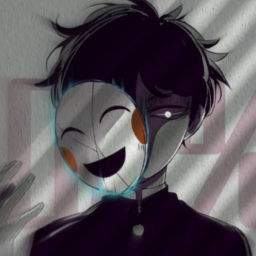

---

```c++
#include <iostream>
#include <vector>
#include <ctime>
#include <iomanip>
#include <sstream>

std::string get_current_timestamp() {
    auto now = std::time(nullptr);
    std::tm tm = *std::localtime(&now);
    std::ostringstream oss;
    oss << std::put_time(&tm, "%Y-%m-%dT%H:%M:%S%z");
    return oss.str();
}

void display_formatted_message(const std::string& message) {
    std::string timestamp = get_current_timestamp();
    std::string separator(50, '=');
    std::cout << separator << std::endl;
    std::cout << "Timestamp: " << timestamp << std::endl;
    std::cout << separator << std::endl;
    std::cout << message << std::endl;
    std::cout << separator << std::endl;
}

int main() {
    std::vector<std::string> messages = {
        "Why do we have to part if we used to laugh together?",
        "I am still here, missing you in silence.",
        "This heart cannot turn away from you.",
        "Fate brought us together, but time separated us.",
        "Life feels empty without you by my side.",
        "Memories of you never fade even as time passes.",
        "This love remains the same, even if your heart has changed.",
        "Every night I wonder, do you miss me too?",
        "I am lost in your shadow that never disappears.",
        "Life feels like a nightmare without your presence."
    };

    if (messages.empty()) {
        std::cout << "No messages found." << std::endl;
        return 0;
    }

    std::string random_message = messages[std::rand() % messages.size()];
    display_formatted_message(random_message);

    return 0;
}
