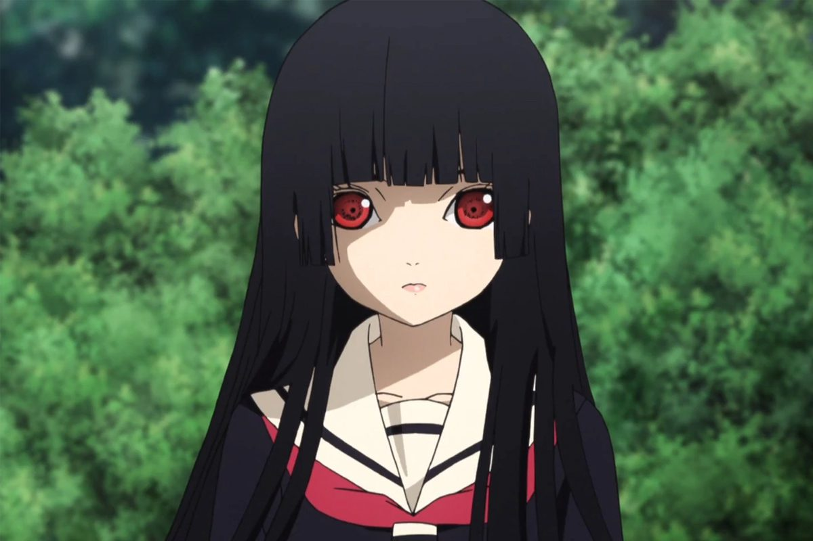

```text
Why did you let someone else destroy our love?
Our beautiful dream was shattered by their presence.
My heart broke when a third person ruined our happiness.
We were happy until they came and separated us.
Our love is fragile in the face of someone who doesn't care.
I never expected our love to be destroyed by their presence.
They came and disturbed the happiness we built together.
I am hurt seeing you leave because of them.
We promised to be faithful, but it all fell apart because of a third person.
This pain is so deep, seeing you choose them over me.
